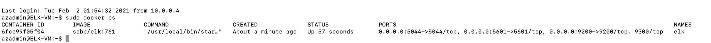
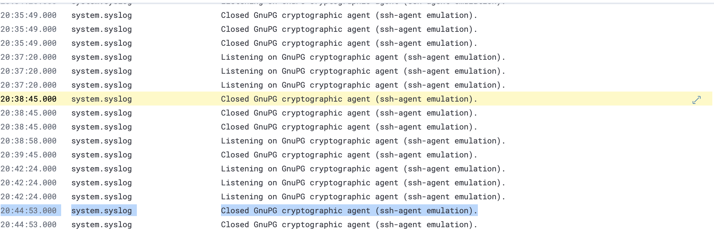
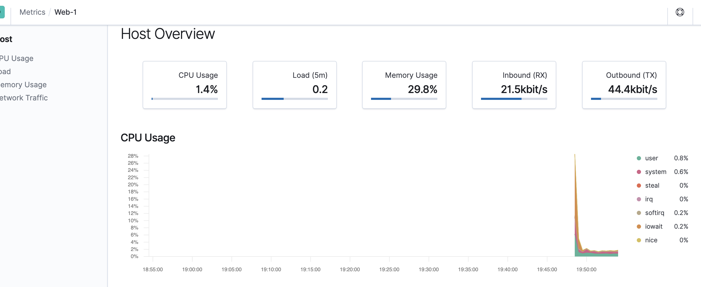

## Automated ELK Stack Deployment

The files in this repository were used to configure the network depicted below.

These files have been tested and used to generate a live ELK deployment on Azure. They can be used to either recreate the entire deployment pictured above. Alternatively, select portions of the playbook file may be used to install only certain pieces of it, such as Filebeat.

  - [elk-playbook.yml](https://github.com/ellieransom/cybersecurity-project-1/blob/main/Ansible/elk-playbook.yml)

This document contains the following details:
- Description of the Topology
- Access Policies
- ELK Configuration
  - Beats in Use
  - Machines Being Monitored
- How to Use the Ansible Build

### Description of the Topology

The main purpose of this network is to expose a load-balanced and monitored instance of DVWA, the D*mn Vulnerable Web Application.

Load balancing ensures that the application will be highly available, in addition to restricting access to the network.
- _What aspect of security do load balancers protect? What is the advantage of a jump box?_
- Load balancers protect against a service being unavailable because one or more servers are unavailable. If one server goes down or is unavailable due to too much traffic (possible DDoS attack), then the load balancer is able to direct traffic to any other webserver without distrupting the service. Using a jump box to manage web servers, means that no one has direct access to the web servers. All admin tasks must be done from the jump box and not from a host machine. This also means that the jump box is only used for admin purposes and no other riskier tasks such as checking email. 

Integrating an ELK server allows users to easily monitor the vulnerable VMs for changes to the logs and system metrics.
- _What does Filebeat watch for?_
- Filebeat is used for forwarding and centralizing log data.
- _What does Metricbeat record?_
- Metricbeat is used for forwarding and centralizing metric data (statistics) from the servers and services running on those servers.

The configuration details of each machine may be found below.

| Name                 | Function   | IP Address | Operating System |
|----------------------|------------|------------|------------------|
| Jump-Box-Provisioner | Gateway    | 10.0.0.4   | Linux            |
| Web-1                | Webserver  | 10.0.0.5   | Linux            |
| Web-2                | Webserver  | 10.0.0.6   | Linux            |
| ELK-VM               | SIEM       | 10.1.0.4   | Linux            |

### Access Policies

The machines on the internal network are not exposed to the public Internet. 

Only the Load Balancer machine can accept connections from the Internet. Access to this machine is only allowed from the following IP addresses:
- 24.193.27.251

Machines within the network can only be accessed by the jump box.
- 10.0.0.4

A summary of the access policies in place can be found in the table below.

| Name                 | Publicly Accessible | Allowed IP Addresses             |
|----------------------|---------------------|----------------------------------|
| Jump-Box-Provisioner | No                  | 24.193.27.251:22                 |
| Web-1                | No                  | 10.0.0.4:22                      |
| Web-2                | No                  | 10.0.0.4:22                      |
| ELK-VM               | Yes                 | 10.0.0.4:22  24.193.27.251:5601  |
| Red-Team-LB          | Yes                 | 24.193.27.251:80                 |

### Elk Configuration

Ansible was used to automate configuration of the ELK machine. No configuration was performed manually, which is advantageous because...
- _What is the main advantage of automating configuration with Ansible?_
- Ansible allows for admins to automate tasks such as configuring servers. Automating these processes means that each new server is configured in an identical way. Using ansible enforces that settings and installation of services are completed for any new server. Automation corrects for human error which may leave a step out or forget what happened the last time the task was done.

The playbook implements the following tasks:
- _In 3-5 bullets, explain the steps of the ELK installation play. E.g., install Docker; download image; etc._
- Installs docker and python and python client for docker
- Increase available memory
- Downloads docker image, sebp/elk:761, and configures the container for certain ports
- Enables the docker container on boot

The following screenshot displays the result of running `docker ps` after successfully configuring the ELK instance.

### Target Machines & Beats
This ELK server is configured to monitor the following machines:
- 10.0.0.5
- 10.0.0.6

We have installed the following Beats on these machines:
- Filebeat
- Metricbeat

These Beats allow us to collect the following information from each machine:
- _In 1-2 sentences, explain what kind of data each beat collects, and provide 1 example of what you expect to see. E.g., `Winlogbeat` collects Windows logs, which we use to track user logon events, etc._
- Filebeat collects log data from the operating system and services running on the VM.
- Filebeat example:

- Metricbeat collects metrics and statistics on the operating system and servics.
- Metricbeat example:

### Using the Playbook
In order to use the playbook, you will need to have an Ansible control node already configured. Assuming you have such a control node provisioned: 

SSH into the control node and follow the steps below:
- Copy the filebeat-playbook.yml file to /etc/ansible/roles/.
- Update the filebeat-config.yml file to include the IP address of your ELK server. Update the filebeat-playbook.yml to run on the webservers (hosts: webservers).
- Run the playbook, and navigate to ELK-VM to check that the installation worked as expected.
  - http://<ELK.VM.External.IP>:5601/app/kibana
  - http://40.75.114.96:5601/app/kibana

_As a **Bonus**, provide the specific commands the user will need to run to download the playbook, update the files, etc._

Download playbook:
- curl https://github.com/ellieransom/cybersecurity-project-1/blob/main/Ansible/filebeat-playbook.yml > /etc/ansible/roles/filebeat-playbook.yml

Edit playbook:
- nano /etc/ansible/roles/filebeat-playbook.yml

Run playbook:
- ansible-playbook /etc/ansible/roles/filebeat-playbook.yml
